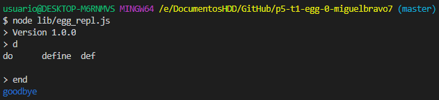
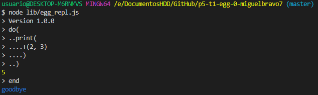

Lenguaje egg :egg::snake:
===

Este lenguaje realizado a lo largo de varias prácticas será uno parecido a `((((lisp))))` comprendido en dos fases *parseado* y *evaluación*, distintas funcionalidades se implementarán en base a estos dos procesos [Coverage de los tests](coverage/lcov-report/index.html). 

Antes de ello, en primera instancia vamos a definir la **gramática**:

*expression* := **STRING**
| **NUMBER**
| **WORD** *apply*

*apply* := /\* vacio \*/
| **'('** ( *expression* **','** ) \* *expression*? **')'** *apply*

Modulos del programa
---
- **tokens**
Archivo que contiene los tokens con el formato:
```js
const TOKEN = {
    type: "TOKEN",
    exp: /reg exp/y,
    compute: function (match) {
        return { type: this.type, value: match[0] };
    }
};
```

- **ast**
Contiene las clases que conforman el `AST` en ellas se implementa el método evaluate

```js
class ClassName {
  constructor(token) {
    this.type = 'value';
    this.value = token.value;
  }
  evaluate() {
    return this.value;
  }
}
```

- **parse**
Esta es la parte de generación de lexemas en base a los tokens definidos en `tokens.js`, esto contiene los métodos de análisis léxico y sintáctico.

-    - parse
    Este método implementa la gramática del lenguaje tomando como entrada la cadena con el codigo del programa

-    - parseExpression
    Corresponde a las producciones que corresponden a expression en la gramática del lenguaje

```js
function parseExpression() {
  var expr;

  if (lookahead.type == "STRING" || lookahead.type == "NUMBER") {
    expr = new Value(lookahead);
  } else if (lookahead.type == "WORD") {
    expr = new Word(lookahead);
  } else {
    throw new SyntaxError(`Unexpected syntax line ${lineno}: ${program.slice(getLastIndex(), 10)}`);
  }
  lex();
  return parseApply(expr);
}
```

-   - parseApply
    Corresponde a las producciones que corresponden a apply en la gramática del lenguaje

```js
function parseApply(tree) {
  if (!lookahead || lookahead.type !== "LP") { // no apply
    return tree;
  }

  lex();

  tree = new Apply(tree);

  while (lookahead && lookahead.type !== "RP") {
    let arg = parseExpression();
    tree.args.push(arg);

    if (lookahead && lookahead.type == "COMMA") {
      lex();
    } else if (!lookahead || lookahead.type !== "RP") {
      throw new SyntaxError(`Expected ',' or ')'  at line ${lineno}: ... ${program.slice(getLastIndex(), 20)}`);
    }
  }
  lex();

  if (!lookahead) {
    return tree;
  }
  return parseApply(tree);
}
```

- **json2AST**
Convierte los archivos egg compilados en formato json convirtiendo los objetos a la clase a la clase a la que pertenece en base a su tipo, se pueden añadir tipos de manera flexible añadiendo métodos con el mismo nombre que el tipo sobre el que se quiere aplicar la conversión.

```js
Json2AST.json2node.apply = tree => {
  let obj = new Apply(tree);
  obj.operator = Json2AST.Json2AST(tree.operator);
  obj.args = tree.args.map(arg => Json2AST.Json2AST(arg));
  return obj;
}

Json2AST.json2node.word = tree => {
  let obj = new Word(tree);
  obj.name = tree.name;
  return obj;
}

Json2AST.json2node.value = tree => new Value(tree);
```

- **eggvm**
Contiene el codigo relativo a la ejecución del Árbol de Análisis Sintáctico generado por los métodos de `parse.js`

-    - topEnv
    Contiene los métodos que tienen una relación directa con los métodos de javascript

-    - specialForms
    Contiene los métodos que requieren una evaluación compleja 

-    - run
    Método que parsea y evalua la cadena del programa egg

```js
function run(program) {
  let env = Object.create(topEnv);
  let tree = parse(program);
  return tree.evaluate(env);
}
```

-    - runFromEVM
    Ejecuta el programa egg compilado `.evm` haciendo uso de Json2AST para traducir los objetos a las clases que seran usadas en el programa

```js
function runFromEVM(fileName) {
  try {
    let json = fs.readFileSync(fileName, 'utf8');
    let tree = Json2AST.Json2AST(JSON.parse(json));
    let env = Object.create(topEnv);
    return tree.evaluate(env);
  }
  catch (err) {
    console.log(err);
  }
}
```

Monkey Patching
---
A los objetos de este lenguaje se le han añadido métodos propios que pueden ser invocados en el programa

```js
Object.prototype["="] = function (value, ...indices) {
  if (value + indices.length < 2) {
    throw new SyntaxError('Bad use of set');
  }

  let index = indices[0];

  if (indices.length === 1) {
    this[index] = value;
    return value;
  }

  const obj = this.sub(index);
  return obj["="](value, ...indices.slice(1));
};
```

Ejecutables
---
- **egg**
Ejecuta el programa a partir de un fichero, crea el AST y lo interpreta al pasarle como argumento la ruta a un programa egg, si ese archivo es un compilado evm lo ejecuta llamando al metodo pertinente, en caso de no recibir ninguna ruta ejecuta el bucle repl
- **eggc**
Compila el fichero egg produciendo un archivo JSON que tiene la extensión `.evm`
- **evm**
Egg Virtual Machine que toma como entrada el archivo JSON creado por `eggc` y lo interpreta

REPL egg
---
El lenguaje también incluye un bucle Read Eval Print Loop para la consola de comandos, este hace uso del modulo `chalk` para el highlighting de las palabras y sugerencias para el completado de palabras al pulsar `tab`



además de un indicador del balance de paréntesis restantes


